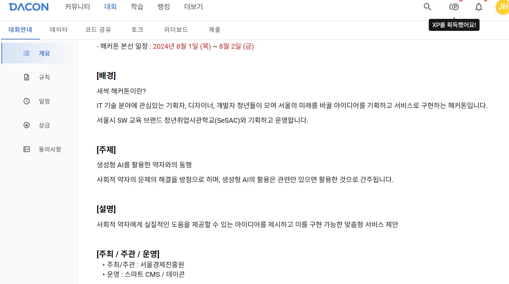
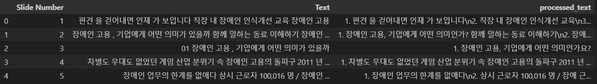
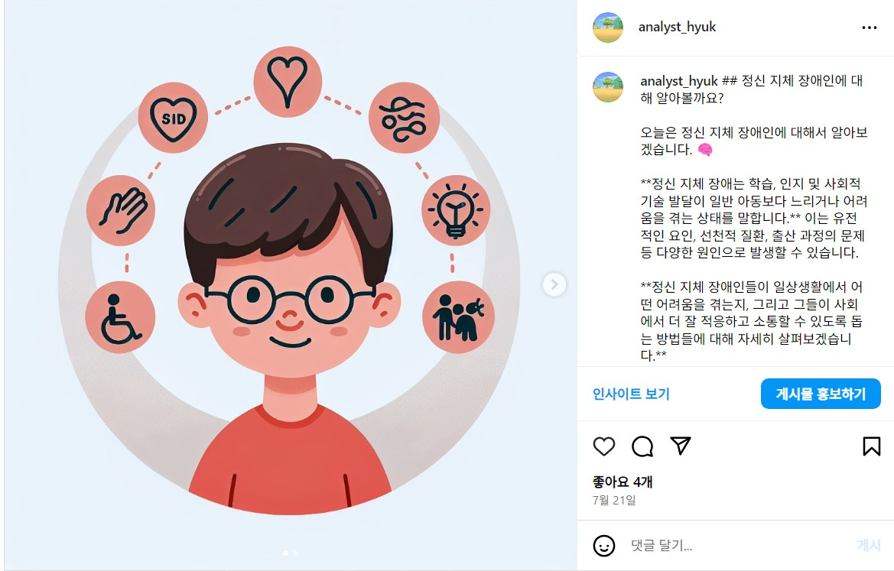
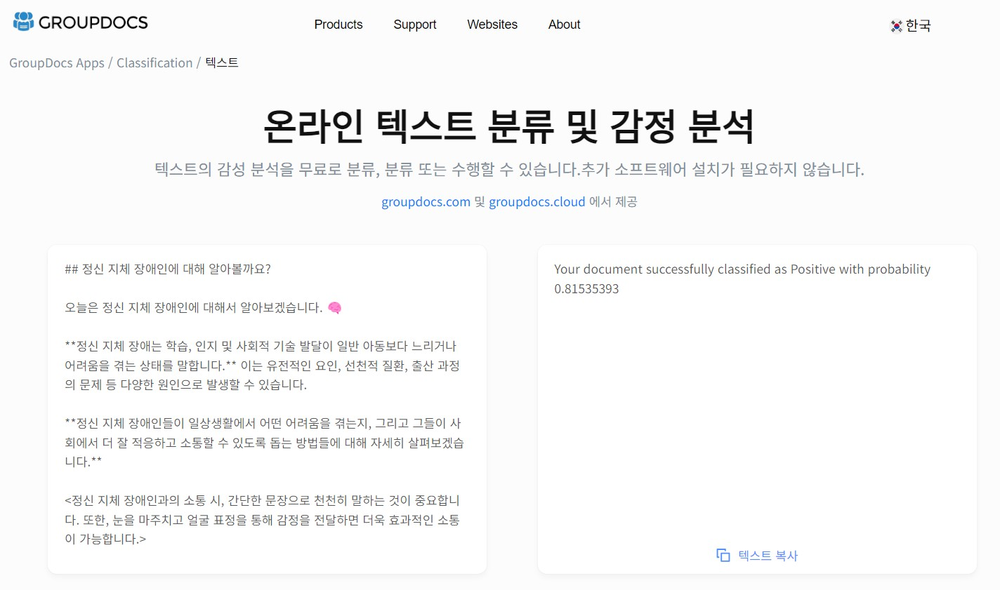

# 사회적 약자를 위한 인식 개선 SNS 봇

### [새싹 해커톤 - 장애인 인식개선을 위한 SNS서비스 "This Abled"](https://dacon.io/competitions/official/236293/codeshare/11391)

### 프로젝트 개요

- **"사회적 약자와의 동행"** 이라는 주제의 데이콘 컨테스트.

  이 프로젝트는 AI를 활용하여 **사회적 약자에 대한 긍정적인 인식을 확산시키기 위해 SNS 봇을 개발하는 것을 목표**로 합니다.
  
  많은 사회적 약자 중에서도 장애인이 고용에서 큰 어려움을 겪고 있고, **장애인의 인식을 개선하는 것**을 통해 조금 더 많은 곳에서 고용되고 차별 받지 않는 사회를 만들고자 하였습니다. 
  
  최근 **전국 장애인 협회의 인원들이 장애인의 인권 신장을 위해  본인들의 목소리를 내는 일이 많아**지고 있습니다. 우리 사회가 이 문제를 함께 해결할 수 있고 상생할 수 있는 길을 찾는 데 **도움이 되길 바라며 프로젝트를 진행**하였습니다.
  
  

### 데이터  설명 및 전처리

- **데이터 출처** : 다양한 정부 기관에서 발행하는 `장애인식개선교육 자료 및 장애인 이해 교육자료`
  - **장애인식개선 교육자료** : 보건복지부, 한국장애인고용공단, 한국장애인개발원 등
  - **장애인 이해 교육자료** : 울산광역시교육청, 전북특별자치도교육청 등

- **설정** : PyPDF2, pptx 라이브러리를 통해 읽을 수 있는 ppt 혹은 pdf파일을 사용하였으며, 텍스트 추출 후 csv파일로 저장하여 관리

- **전처리** : ppt, pdf의 각 슬라이드에서 추출된 텍스트를 LLM을 통해 원본으로 되돌리는 작업 수행
  - LLM에게 문서의 모든 내용을 넣고 문장별로 끊어달라고 하는 경우, 내용을 임의로 요약하며 생략된 내용이 발생하는 경우가 있어, 아래와 같은 순서로 나누어 처리함.
    1. 슬라이드 넘버에 맞게 DataFrame형식으로 저장 (`Text` column) 
    2. 나누어진 텍스트를 20문장씩 합친 후 LLM에게 원본처럼 복원 실행.

> 슬라이드 내용이 많을수록 메모리 사용량이 늘어나지만, LLM 학습에 있어 클린데이터를 학습시킬 수 있고 RAG의 답변 결과가 좋아짐.

### 기술 스택 

- **프로그래밍 언어** : Python

- **라이브러리** : 
  - 데이터 읽기 : PyPDF2, PyMuPDF(`fitz`), python-pdfplumber, pptx
  - 데이터 저장 : pandas, dotenv(`환경 변수`)
  - 모델 설정 : Hugging Face(`transformers, langchain`), openai(`stable diffusion`)
  - 형태소 분석기 : Kiwi (`리트리버 앙상블을 통한 검색 성능 개선`)

### 주요 결과 

- 간단한 키워드를 통한 인스타그램 게시글 생성 가능 

(실제 LLM을 통해 생성한 게시글로, 답변 관리까지 봇이 대신할 수 있도록 설계)

(생성된 텍스트에 대한 감정 분석을 했을 때, 약 80% 이상 긍정적으로 받아들여질 수 있는 메시지를 제공할 수 있을 것으로 예상)

### 향후 개선 방향

- 파이썬 모듈화 및 자동화를 통해, 사람들의 질문이 달렸을 경우 일정 시간에 맞게 자동으로 대답해줄 수 있는 기능 추가할 수 있음.

- 멀티모달을 활용하여 시각적인 정보와 함께 많은 장애인을 도와줄 수 있는 기능을 추가할 수 있을 것으로 고려됨.

  예를 들면)

  - 신체장애의 경우, 시각적인 정보를 활용한 길잡이 도움 서비스
  - 지체장애의 경우, 실시간 전화음성 데이터 분석을 통한 사기 방지 서비스