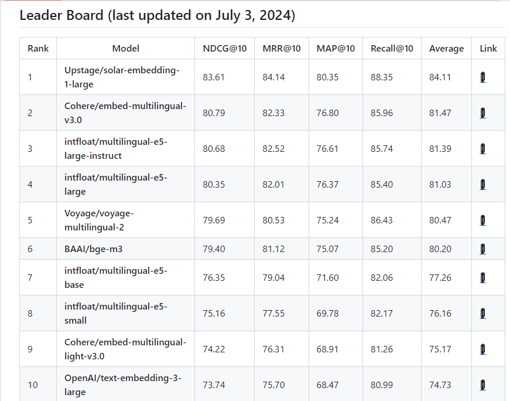

# Kor 임베딩 / DB(FAISS, Chroma) 성능 비교

상태: 시작 전

임베딩이란?

자료: [Embedding이란 무엇인가?](https://www.syncly.kr/blog/what-is-embedding-and-how-to-use)

오픈소스 임베딩 모델을 사용할 거라면 

- `intfloat/multilingual-e5-large-instruct`
- `intfloat/multilingual-e5-large`
- `BAAI/bge-m3`

출처 : [https://github.com/Atipico1/Kor-IR](https://github.com/Atipico1/Kor-IR)

### VectorStore

참고자료: [VectorDB 비교 `FAISS vs Chroma`](https://myscale.com/blog/faiss-vs-chroma-vector-storage-battle/)

- `FAISS`: Nearest Neighbor(최근접 이웃 알고리즘)을 사용, GPU 기반 신속한 검색 제공
- `Chroma` : 경량화 디자인 모델로, 벡터임베딩의 효율적인 저장과 쿼리 사용을 통해 LLM 성능 향상
