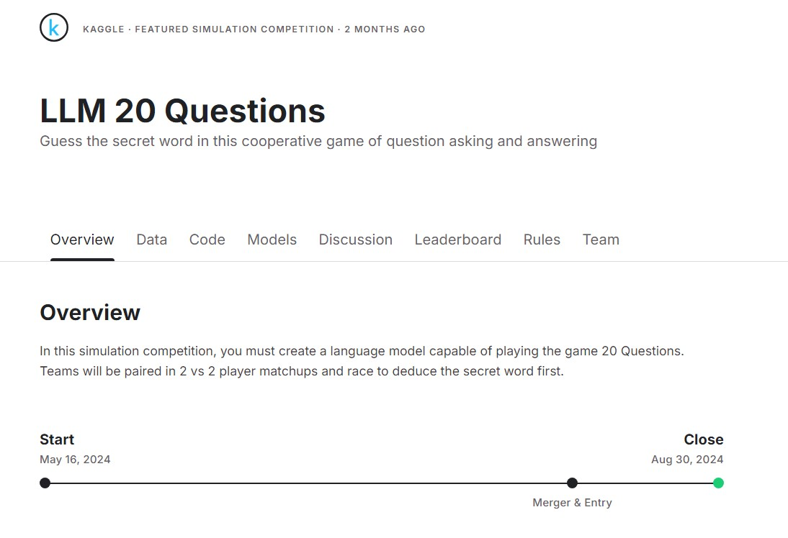

# Kaggle - LLM for 20 questions

### [대회 - Kaggle 스무고개 컴피티션](https://www.kaggle.com/competitions/llm-20-questions)

---

### 프로젝트 개요

- 대형 언어 모델(LLM)을 활용하여, 스무고개 게임을 진행하여 에이전트(봇)의 선택을 예측하는 게임입니다.

>  **[진행 설명]**
>
> - 에이전트는 랜덤하게 2 vs 2 팀으로 맺어져, 질문과 답을 통해 스무고개의 답을 추론해가는 과정을 진행한다.
> - 모든 대답은 `Yes` or `No` 로만 대답 가능하며, 에피소드 진행에 따른 추론을 진행한다.
> - 에이전트는 `질문자_questioner`, `답변자_answerer`, `추론자_guesser`로 나누어지며, answer or guess의 값에 답이 나오면 스무고개를 종료한다.
>

### 데이터 설명

- **출처** : Kaggle competition의 keywords.py, NLTK library 내부의 명사 데이터
- **주요 특징** : 
  - Keywords_local.py : 파이썬 내부 파일에서 Json Format으로 작성되어 불러올 수 있음
  - nltk.download('punkt') : NLTK 라이브러리에서 제공하는 단어 데이터들.
- **설정** : Fine-tuning 없이 사전 학습된 모델 활용

### 기술 스택

- **프로그래밍 언어** : Python
- **라이브러리** : Pandas, Pytorch, Hugging face transformers library, NLTK

- **모델** : Transformers Model(`llama3-8b`), `Gemma`, `Gemma2`

### 주요 결과

- 스무고개 10게임 중 한 번 답을 맞출 정도로, 좋은 성적은 거두지 못하였습니다.
- LLM에 대한 이해를 할 수 있는 대회로, 프롬프트와 RAG에 대한 지식을 쌓았습니다.

### 학습 노트

1. **Started Code 분석**
   - Kaggle 대회에서 아주 기본적인 제출을 위한 starter code를 공부하고 분석함.
2. **Input File 분석 및 Game Scenario 분석**
   - 대회에서 기본적으로 제공하고 있는 keywords에 대해 어떻게 나눌 것인지 rule base 접근.
   - 좋은 질문이란 무엇인가에 대해 팀원들과 같이 의견을 나눔.
3. **RAG & 프롬프트 엔지니어링 공부**
   - 현재 LLM이 갖고 있는 문제와 이를 해결하기 위한 방법에 대한 공부.
     - RAG(Retrieval-Augmented Generation)에 대한 공부.
     - 언어모델을 잘 사용하기 위한 프롬프트 엔지니어링 공부.
4. **Local Test - llama3-8b, Gemma2-9b**
   - 에이전트를 로컬에서 실행하고, 시나리오가 어떻게 작동되는지 상세 분석.
   - 모델 벤치마크를 확인하여 더 좋은 성능의 모델 적용을 고민함.
5. **Fine Tuning이란**
   - LLM의 성능을 올리는 방법에 대한 공부로, fine tuning과 RAG를 비교하여 공부함.
6. **Tokenizer의 이해**
   - transformer library가 제공하는 llama3 모델을 사용하기 위해 tokenizer가 프롬프트 내에서 어떻게 쓰이는지를 공부함.
   - LLM은 결국 언어모델이기 때문에, tokneizer의 활용을 통해 role을 부여하고 이를 활용하여 대화를 주고받는 세션을 마련한다는 것을 확인하고, 프롬프트 엔지니어링에 적용할 수 있었음.
7. **Information Gain by Questions** 
   - 키워드를 절반으로 잘 나누는지의 평가를 위해, tree기반 모델들이 사용하는 정보 획득(Information gain)과 불순도(Impurity Entropy) 개념을 사용하고자 하였음.
   - LLM을 통해 분류가 가능했으나, 단어 하나하나를 읽어 모델에게 답을 시키기 때문에 시간이 오래 걸린다는 단점이 있었음.
   - Keywords_local.py에서 얻는 키워드의 한계를 느끼고, NLTK libary를 통해 다운받을 수 있는 명사 데이터를 추가로 사용하고 대회에 적용하고자 함.

---

#### 모델 상세

1. **Gemma-7b-it-quant**

   - 양자화 모델로 경량화를 거쳤고, 캐글에서 라이선스 승인 후 사용하기 쉬운 모델.
   - 사람들이 가장 많이 참고하는 스타터 코드에 사용된 모델이며, 리더보드 평균(LB600) 정도의 점수를 거두었다.
   - 생각보다 추론 확률이 좋지 않았다. 10게임 중 정답을 맞춘 게임이 고작 1~2판 정도임에도 성적을 올릴 수 있었던 건, 상대팀의 agent들이 자멸했기 때문.

   

2. **llama3-8b-chat**

   - keywords.py 안의 키워드를 Information gain에 따라 분류해보기 위해 사용한 모델.
   - 리더보드 상위 10~20%정도의 점수를 거두었다. (LB750)
   - 프롬프트 엔지니어링을 적용하여 제출한 모델이지만 여전히 정답을 많이 맞추진 못함.
     - 여전히 10판 하면 1~2판을 이기는 수준
     - 다만, 한 번 오류에 빠졌을 때, 같은 대답을 계속하진 않는 모델로 조금은 나아진 성능을 보인다.
   - 질문 순서는 "is it place" -> "is it man-made?" 를 기본으로 하며, 이 질문을 기반으로 좁혀나갈 수 있도록 프롬프트를 설계. (약간의 rule-base를 더하여 성능 향상)

   

3. **Gemma2-9b-it**

   - 조금 더 좋은 성능의 LLM을 찾아보다 적용한 모델. 
   - 모델이 커서 agent 제출이 되진 않았다. 다만, 로컬에서 agent를 만들어 스무고개 시나리오를 진행했을 때 예측 성능이 향상된 걸 확인함.
   - 모델에서 크기가 어느정도 커질 때 약간의 quantum jump(일정 파라미터를 기점으로 성능이 증가하는 현상) 확인이 되었으며, 양자화 모델을 사용하여 경량화 된다면 더 좋은 성적을 낼 수 있지 않았을까 함.
