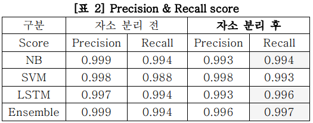

## 머신러닝을 이용한 불법 의약품 판매 게시글 탐지


### 프로젝트 개요

- 이 프로젝트는 머신러닝을 활용하여 소셜 미디어 게시글 중 불법 의약품 거래와 관련된 게시글 신고를 위해 불법 여부를 판별하는 것을 목표로 합니다.


### 데이터 설명

- 출처 : 트위터 크롤링 패키지인 twitterscrapper를 이용한 데이터 수집 (약 10만 건)
  - 키워드 : 마약, 아이스, 도리도리 등등
  - 주요 특징: 텍스트 데이터로 이루어져 있으며, 각 게시글은 "불법(1)" 또는 "합법(0)"으로 분류됨.
  - 전처리 과정 : 불용어 제거, 토큰화, TF-IDF 벡터화


### 기술 스택

- 프로그래밍 언어 : Python
- 라이브러리 : Pandas, Scikit-learn, NLTK, Mecab
- 모델 : Random Forest, SVM, Naive Bayes


### 주요 결과

</img>

- 재현율(Recall) : 0.994
- 정밀도(Precision) : 0.990, 조화평균(F1-Score) : 0.991
- 주요 성과 : 불법 의약품 관련 게시글을 성공적으로 판별하여 90%이상의 목표 지표를 달성.


### 향후 개선 사항

- 마약 거래 게시글들은 일부 패턴이 유사하여 오버피팅의 위험이 존재. 더 많은 데이터 수집을 통해 성능 향상 고려 가능.

- 한글은 모양을 다양하게 만들어 텍스트 기반의 필터링을 피할 수 있어, 77ㅑ(`꺄`) 와 같은 단어는 걸러낼 수 없는 한계가 존재.
- CNN과 OCR등 이미지 기반 탐지 모델 개발 고려
  - 이미지로 텍스트를 먼저 읽어, 의도적으로 불완전한 문장을 완전한 문장으로 해석 가능


---

#### 데이터 상세

- 수집된 게시글 라벨링

  | Text                                            | Label |
  | ----------------------------------------------- | ----- |
  | 집에서도 만들 수 있는 나만의 아이스크림 제조법  | 0     |
  | ㅁㅣ프진 작ㄷㅐㄱㅣ 안전거래 ㅋㅏ톡주세요 ...   | 1     |
  | #ㅇㅏㅇㅣ스 삽니다 #얼음삽니다 #ㅊㅏㄱㅏ운술... | 1     |

  > 불법 의약품 판매 게시글인 경우 1, 아닌 경우 0으로 분류하였습니다.


- 특문, 링크 제거 및 형태소 분석 

  - 한글 형태소 분석기 MeCab을 사용하여, `명사, 고유명사, 동사, 형용사, 어근, Unknown-신조어 등 알 수 없는 단어` 만을 추출

  ```python
  import MeCab
  
  # 특정 형태소만 가져오기 위한 리스트 생성 후 함수 생성
  custom_list =  ["NNP","NNG","VV","VA","XR", "UNKNOWN"]
  ```

  

- 가져온 단어들을 자소 분리 - 깃헙의 hgtk 툴킷을 사용 (집 -> ㅈㅣㅂ)

  | 자소 분리 전                                                | 자소 분리 후                                                 |
  | ----------------------------------------------------------- | ------------------------------------------------------------ |
  | 작ㄷㅐ기 떨 ㅇㅏ이스 차가운술<br />자세한 내용은 쪽지로 ... | ㅈㅏㄱㄷㅐㄱㅣ  ㄸㅓㄹ ㅇㅏㅇㅣㅅㅡ <br />ㅊㅏㄱㅏㅇㅜㄴㅅㅜㄹ  ㅈㅏㅅㅔㅎㅏㄴ <br />ㄴㅐㅇㅛㅇㅇㅡㄴ   ㅉㅗㄱㅈㅣㄹㅗ... |


---

#### **결과**

> 불법 판매 게시글을 하나라도 더 잡는 것보다, 무고한 한 명의 유저의 이탈을 막는 것이 더 중요하다고 생각했기 때문에 Recall을 보는 것이 중요하다고 판단하였습니다.

</img>

- 의약처에서 주관한 '빅데이터를 활용한 불법 의약품 관리 공모전' 우수상 수상
- KCC2020(한국컴퓨터종합학술대회 논문집) 제3저자 게재


